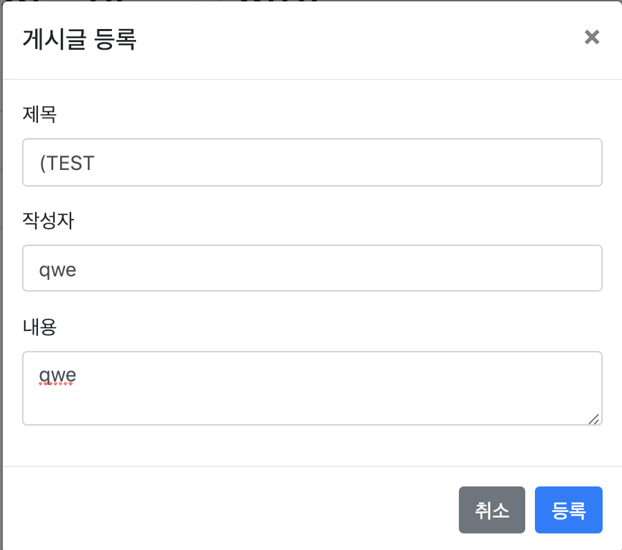
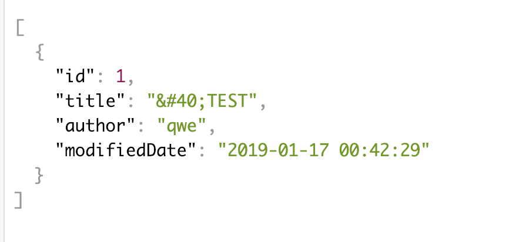

# Spring-Boot-XSS-Protection

### Thymeleaf - Using Unescaped Text

기본적으로 Thymeleaf는 escaping 기능 제공. 따라서, XSS Protection 적용을 위해 Unescaped Text를 사용해야 한다.
https://www.thymeleaf.org/doc/tutorials/3.0/usingthymeleaf.html#unescaped-text

```html
<p th:utext="#{home.welcome}">Welcome to our grocery store!</p>
``` 

```html
<p>Welcome to our <b>fantastic</b> grocery store!</p>
```

### Message Converter

Message Converter의 Object Mapper가 JSON 문자열을 생성하여 Response로 반환 시, Escaping을 하도록 한다.

1. HTMLCharacterEscapes 작성

```java
package me.sml.xssdemo;

import com.fasterxml.jackson.core.SerializableString;
import com.fasterxml.jackson.core.io.CharacterEscapes;
import com.fasterxml.jackson.core.io.SerializedString;
import org.apache.commons.text.translate.AggregateTranslator;
import org.apache.commons.text.translate.CharSequenceTranslator;
import org.apache.commons.text.translate.EntityArrays;
import org.apache.commons.text.translate.LookupTranslator;

import java.util.Collections;
import java.util.HashMap;
import java.util.Map;


public class HTMLCharacterEscapes extends CharacterEscapes {

    private final int[] asciiEscapes;

    private final CharSequenceTranslator translator;

    public HTMLCharacterEscapes() {

        /**
        * 여기에서 커스터마이징 가능
        * 이전의 Apache Commons Lang3는 LookupTranslator의 파라미터로
        * String[][]을 전달하였으나, 새로운 Apache Commons Text는 파라미터로
        * Map<CharSequence, CharSequence>를 전달해야 한다.
        * */
        Map<CharSequence, CharSequence> customMap = new HashMap<>();
        customMap.put("(", "&#40;");
        Map<CharSequence, CharSequence> CUSTOM_ESCAPE = Collections.unmodifiableMap(customMap);

        // XSS 방지 처리할 특수 문자 지정
        asciiEscapes = CharacterEscapes.standardAsciiEscapesForJSON();
        asciiEscapes['<'] = CharacterEscapes.ESCAPE_CUSTOM;
        asciiEscapes['>'] = CharacterEscapes.ESCAPE_CUSTOM;
        asciiEscapes['&'] = CharacterEscapes.ESCAPE_CUSTOM;
        asciiEscapes['('] = CharacterEscapes.ESCAPE_CUSTOM;

        // XSS 방지 처리 특수 문자 인코딩 값 지정
        translator = new AggregateTranslator(
                new LookupTranslator(EntityArrays.BASIC_ESCAPE),  // <, >, &, " 는 여기에 포함됨
                new LookupTranslator(EntityArrays.ISO8859_1_ESCAPE),
                new LookupTranslator(EntityArrays.HTML40_EXTENDED_ESCAPE),
                new LookupTranslator(CUSTOM_ESCAPE)
        );

    }

    @Override
    public int[] getEscapeCodesForAscii() {
        return asciiEscapes;
    }

    @Override
    public SerializableString getEscapeSequence(int ch) {
        return new SerializedString(translator.translate(Character.toString((char) ch)));
        // 참고 - 커스터마이징이 필요없다면 아래와 같이 Apache Commons Text에서 제공하는 메서드를 써도 된다.
        // return new SerializedString(StringEscapeUtils.escapeHtml4(Character.toString((char) ch)));
    }
}
```
> 이전의 Apache Commons Lang3는 LookupTranslator의 파라미터로 String[][]을 전달하였으나, 새로운 Apache Commons Text는 파라미터로 Map<CharSequence, CharSequence>를 전달해야 한다.

2. WebMvcConfigurer에 MessageConverter 작성

```java
package me.sml.xssdemo;


import com.fasterxml.jackson.databind.ObjectMapper;
import com.fasterxml.jackson.databind.SerializationFeature;
import com.fasterxml.jackson.datatype.jsr310.JavaTimeModule;
import com.navercorp.lucy.security.xss.servletfilter.XssEscapeServletFilter;
import org.springframework.boot.web.servlet.FilterRegistrationBean;
import org.springframework.context.annotation.Bean;
import org.springframework.context.annotation.Configuration;
import org.springframework.http.converter.HttpMessageConverter;
import org.springframework.http.converter.json.MappingJackson2HttpMessageConverter;
import org.springframework.web.servlet.config.annotation.WebMvcConfigurer;

import java.util.List;

@Configuration
public class WebConfig implements WebMvcConfigurer {

    @Override
    public void configureMessageConverters(List<HttpMessageConverter<?>> converters) {
        converters.add(escapingConverter());

    }

    @Bean
    public HttpMessageConverter escapingConverter() {
        ObjectMapper objectMapper = new ObjectMapper();
        objectMapper.getFactory().setCharacterEscapes(new HTMLCharacterEscapes());

        MappingJackson2HttpMessageConverter escapingConverter =
                new MappingJackson2HttpMessageConverter();
        escapingConverter.setObjectMapper(objectMapper);

        return escapingConverter;
    }

}

```

### 작동 확인

1. 글 작성



2. JSON Response 확인



> 커스터마이징한 "("가 "&#40;"으로 바뀐 것을 확인 할 수 있다.

---

### 기본 프로젝트 환경 셋팅

https://jojoldu.tistory.com/255?category=635883

### 참고

* http://serverwizard.tistory.com/67
* https://github.com/HomoEfficio/dev-tips/blob/master/Spring%EC%97%90%EC%84%9C%20JSON%EC%97%90%20XSS%20%EB%B0%A9%EC%A7%80%20%EC%B2%98%EB%A6%AC%20%ED%95%98%EA%B8%B0.md